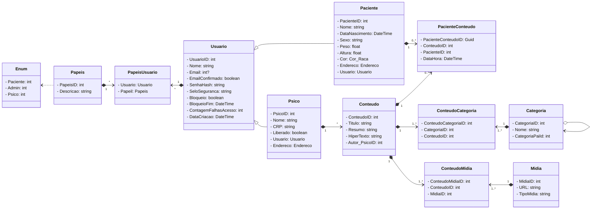

# PsiUWeb - Programação II
Ciência da Computação. UNOESC. 4ª Fase

## Stack
* .NET Core 6. Model-View-Controller
* Entity Framework Core
* SQL Server
* Docker

## Escopo
Elaboração de projeto para desenvolvimento de um software WebApp para auxílio na SAÚDE MENTAL.
> Sugestão de nome: PSI-U.APP.BR

O sistema tem por objetivo fornecer conteúdos de áudio, imagens e textos, organizados categoricamente de modo
que os usuários cadastrados possam acessar e consumir o material com o objetivo de minimizar os impactos
psicológicos e emocionais causados pelo stress do cotidiano.

## Análise de requisitos
As especificações abaixo contemplam o que definimos como a composição de um escopo inicial para versão 1.0;

### Não funcionais
-|-
-|-
RNF.01 | App disponível via Web, acessível por qualquer dispositivo munido de um navegador de internet (celular, tablet, notebook, smart tv, etc.): interface responsiva;
RNF.02 | Servidor de hospedagem para aplicação, banco de dados e armazenagem de arquivos (imagens e áudios): Custo mensal de acordo com plano contratado;
RNF.03 | Registro de domínio (endereço web / url): Custo anual atual de R$ 40,00 sem contar mão de obra de gerenciamento;
RNF.04 | Elaboração de política de privacidade; Podemos sugerir modelo padrão que poderá ser revisado posteriormente;
RNF.05 | Elaboração de logomarca; 

### Funcionais
-|-
-|-
RF.01 | Cadastro e gerenciamento de Usuários: Inicialmente 3 categorias de usuários – Admin - Psico – Paciente;
RF.02 | Cadastro e gerenciamento de categorias de conteúdo: Possibilitar a organização das categorias em uma estrutura de dados em árvore; Apenas usuários Admin e Psico;
RF.03 | Cadastro e gerenciamento de conteúdo: Conteúdo deve possuir título, lead, imagem de capa, arquivo de áudio, texto livre em formato de hipertexto para formatação livre estilo blog palavras-chave para assuntos relacionados;
RF.04 | Acesso dos conteúdos; Visualizações devem ser contabilizadas para utilização de dados estatísticos futuros;
RF.05 | Página inicial de apresentação do projeto;

  
Diagramas

## Classe
    

  ## Classe
  

  ## Caso de uso
  

